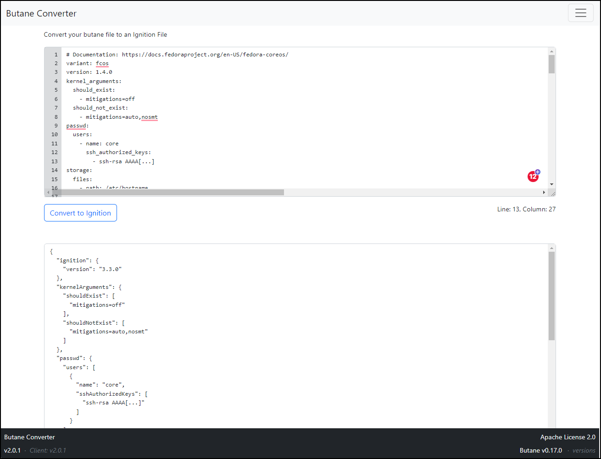

# Butane Converter
Butan Converter can convert a human-readable Butane Config into a machine-readable Ignition Config file using a web interface.

Butane Converter is a UI extension of the official butane docker image quay.io/coreos/butane:release. RedHat's original docker image has been taken and is being extended by a GO-based web UI. This means Butan Converter always uses the latest command line tool.

## Quick start
### Online Version
Here you can find the online version: https://butane.meixxi.com

### Run locally using Docker
```
docker run -p 8080:8080 ghcr.io/meixxi/butane-converter:latest
```
Docker Repo on github: https://github.com/meiXXI/butane-converter/pkgs/container/butane-converter

## Screen
Here is a screen shot of the butaon converter:
  


## API

| Endpoint | Method | Description |
|---|---| ---- |
| /api/v0/convert | POST | Convert Butane to Ignition. |
| /version | GET | Version details. |


### Example
Converting a Butane file using the REST API
```
curl --data-binary "@grafana.bu.yml" https://butane.meixxi.com/api/v0/convert
```